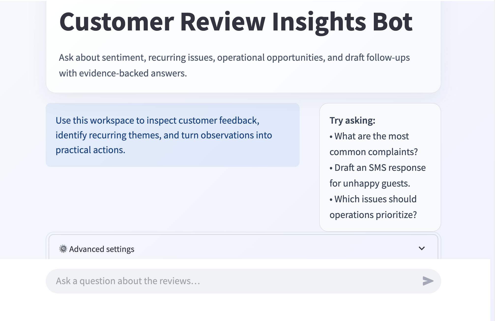

# Restaurant Review Analyzer

This project helps a restaurant team turn customer feedback into practical action. It can clean review text, separate owner replies from customer comments, group similar complaints, and answer questions with help from AI.

It is built for people who want to understand what guests are saying without reading hundreds of reviews one by one.

## What this project does

The project works in three simple steps:

1. It reads review text.
2. It finds patterns such as slow service, rude staff, or food quality issues.
3. It helps you ask questions such as, “What are customers complaining about most?”

The app can also suggest follow-up messages and operational next steps when the question is action-oriented.

## Who this is for

This project is useful for:

- restaurant owners
- managers
- customer experience teams
- analysts
- students learning about AI and review analysis

## Key features

- Clean and organize raw review data
- Detect owner responses and keep them separate
- Split long reviews into smaller chunks for analysis
- Detect themes such as food quality or speed of service
- Measure sentiment such as positive, neutral, or negative
- Search review content with AI-powered embeddings
- Answer grounded questions using the review data itself
- Provide a Streamlit chat experience for everyday use

## Screenshots



## Quick start

The fastest way to try the app is to install the required software, add your API keys, and run the Streamlit web app.

### 1. Make sure you have Python installed

You need Python 3.10 or newer.

Check your version by opening a terminal and running:

```bash
python3 --version
```

If that does not work, try:

```bash
python --version
```

### 2. Open the project folder

In your terminal, go to the repository folder:

```bash
cd /path/to/Resturant-Review-Analyzer
```

### 3. Create a virtual environment

A virtual environment keeps the project libraries separate from the rest of your computer.

On macOS or Linux:

```bash
python3 -m venv venv
source venv/bin/activate
```

On Windows:

```bash
python -m venv venv
venv\Scripts\activate
```

### 4. Install the required libraries

This downloads the Python libraries that the project needs.

```bash
pip install -r requirements.txt
```

### 5. Create a .env file

Create a file named .env in the project root. This file stores private settings such as API keys.

Example:

```env
OPENAI_API_KEY=your_openai_key_here
PINECONE_API_KEY=your_pinecone_key_here
PINECONE_INDEX=reviews-index
PINECONE_CLOUD=aws
PINECONE_REGION=us-east-1
OPENAI_EMBED_MODEL=text-embedding-3-small
OPENAI_MODEL=gpt-4.1-mini
BUSINESS_NAME=Example Restaurant
BUSINESS_LOCATION=Example City
REVIEW_SOURCE=google
```

### 6. Run the app locally

This starts the web interface in your browser.

```bash
python3 -m streamlit run streamlit_app.py
```

Then open the local address shown in the terminal, usually http://localhost:8501.

## Requirements

| Requirement | Details |
| --- | --- |
| Operating system | macOS, Linux, or Windows |
| Python | Version 3.10 or newer |
| Package manager | pip |
| External services | OpenAI API and Pinecone |
| Optional | A review dataset in JSON format |

## Repository structure

- app/ contains the core Python modules for retrieval, sentiment, themes, and utilities.
- data/ contains sample review data and prepared chunk files.
- reviews-scraper/ contains a small helper for collecting review data from Google reviews pages.
- scripts/ contains the data-processing steps for cleaning, chunking, indexing, querying, and evaluation.
- streamlit_app.py contains the web interface.

## Environment variables

| Name | Required | Default | Description | Example |
| --- | --- | --- | --- | --- |
| OPENAI_API_KEY | Yes | None | Allows the app to call OpenAI models. | sk-... |
| PINECONE_API_KEY | Yes | None | Allows the app to connect to Pinecone. | ... |
| PINECONE_INDEX | No | reviews-index | The Pinecone index name to use. | reviews-index |
| PINECONE_CLOUD | No | aws | The Pinecone cloud provider. | aws |
| PINECONE_REGION | No | us-east-1 | The Pinecone region. | us-east-1 |
| OPENAI_EMBED_MODEL | No | text-embedding-3-small | The model used to create embeddings. | text-embedding-3-small |
| OPENAI_MODEL | No | gpt-4.1-mini | The chat model used for grounded answers. | gpt-4.1-mini |
| BUSINESS_NAME | No | Unknown Business | Used when cleaning review data. | Crimson Coward |
| BUSINESS_LOCATION | No | Unknown Location | Used when cleaning review data. | Fredericksburg |
| REVIEW_SOURCE | No | google | Used as metadata when cleaning reviews. | google |

## Running the project

### Development

Use the Streamlit app for interactive exploration:

```bash
python3 -m streamlit run streamlit_app.py
```

### Data processing pipeline

If you want to prepare your own review data, run the scripts in order:

```bash
python3 -m scripts/01_clean_reviews.py --in data/raw_reviews.json --out data/cleaned_reviews.json
```

This step reads raw review data and prepares a cleaner dataset.

```bash
python3 -m scripts/02_chunk_reviews.py --in data/cleaned.json --out data/chunks.jsonl
```

This step splits reviews into smaller chunks and adds theme and sentiment information.

```bash
python3 -m scripts/03_index_pinecone.py --chunks data/chunks.jsonl --reset
```

This step sends the chunks to Pinecone so the app can search them quickly.

```bash
python3 -m scripts/04_query_bot.py --q "What are the main complaints?"
```

This step asks the retrieval system a question and prints the result.

## Common tasks

- Start the app: run the Streamlit command above.
- Rebuild the indexed review data: rerun the cleaning, chunking, and indexing scripts.
- Use sample data: the repository already contains sample files in data/.
- Ask a question: type it into the chat box in the Streamlit app.

## Troubleshooting

### The app does not start

Possible cause: the required Python libraries were not installed.

Fix:

```bash
pip install -r requirements.txt
```

### The app says a key is missing

Possible cause: the .env file is missing or incomplete.

Fix: add OPENAI_API_KEY and PINECONE_API_KEY to your .env file.

### Import errors appear

Possible cause: the script was run incorrectly.

Fix: use the module form of the command, for example:

```bash
python3 -m streamlit run streamlit_app.py
```

## FAQ

### What is a virtual environment?

It is a small, isolated folder that keeps the project libraries separate from the rest of your computer.

### Why do I need API keys?

The app uses OpenAI and Pinecone to create embeddings and generate answers. Those services require valid keys.

### Where is my data stored?

Review files are stored in the data/ folder. Indexed vectors are stored in Pinecone, not in the local repository.

## Documentation

For a fuller guide, see the docs/ folder.

- [docs/README.md](docs/README.md)
- [docs/getting-started.md](docs/getting-started.md)
- [docs/troubleshooting.md](docs/troubleshooting.md)

## Notes

This repository does not currently include a deployment pipeline or a traditional database. The current workflow is local-first and uses external AI and vector services.

TODO: Information about production deployment could not be determined automatically.

---

## Error: `chunks.jsonl is empty`

Cause:
The cleaning step failed or input reviews are empty.

Fix:
Run the cleaning script again and check output.

---

# What Is Pinecone?

Pinecone is a vector database.

Instead of searching keywords, it searches meaning.

Example:

* User asks:

  > "Do customers complain about slow service?"
* Pinecone finds semantically similar review chunks even if they do not use the exact words "slow service."

---

# What Is RAG?

RAG = Retrieval-Augmented Generation.

It works like this:

```text
User Question
      ↓
Find Relevant Review Chunks
      ↓
Send Chunks to AI
      ↓
Generate Grounded Answer
```

This prevents hallucinations because the AI answers using your real review data.

---

# Recommended Beginner Workflow

Run these in order:

## 1. Clean reviews

```bash
python -m scripts.clean_reviews \
  --in data/raw_reviews.json \
  --out data/cleaned_reviews.json
```

## 2. Chunk reviews

```bash
python -m scripts.chunk_reviews \
  --in data/cleaned_reviews.json \
  --out data/chunks.jsonl
```

## 3. Index into Pinecone

```bash
python -m scripts.index_pinecone \
  --chunks data/chunks.jsonl \
  --reset
```

## 4. Query the chatbot

```bash
python -m scripts.query_bot \
  --q "What issues appear most often?"
```

---

# Recommended Improvements

As you learn more, you can add:

* FastAPI backend
* Streamlit frontend
* LangChain
* Better theme classification
* Better evaluation metrics
* Multi-business support
* Dashboard UI
* Automated review scraping

---

# Final Notes

This project teaches real-world AI engineering concepts:

* embeddings
* vector databases
* semantic search
* RAG pipelines
* AI grounding
* data preprocessing

If you are a beginner:

* Start slowly
* Run one script at a time
* Print intermediate outputs
* Read the JSON files to understand the data flow

That is how real AI systems are built.
