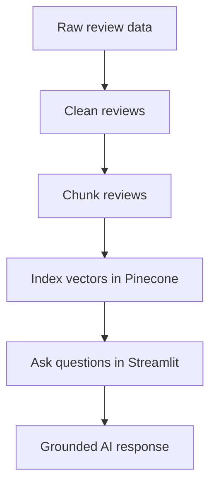

# Architecture

This project is a local-first review analysis pipeline.

## High-level flow

## Main parts

- scripts/01_clean_reviews.py prepares the review data.
- scripts/02_chunk_reviews.py splits reviews into chunks and adds metadata.
- scripts/03_index_pinecone.py stores the chunks in Pinecone.
- scripts/04_query_bot.py asks a question against the indexed data.
- streamlit_app.py provides the user-facing web interface.
- app/rag.py connects the retrieval and generation steps.

## Notes

This repository does not currently include a traditional database or a production deployment setup. It relies on local files and external cloud services.
